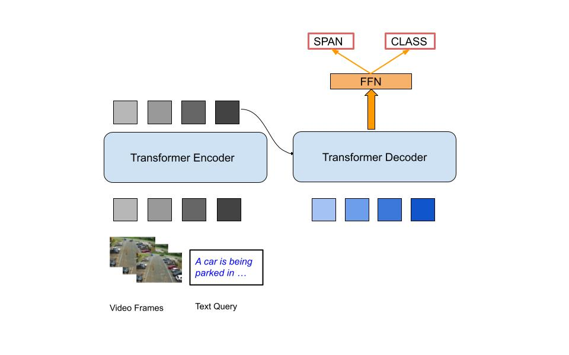

# Localizing Moments in Surveillance Videos using Natural Language Queries

We localize moments in videos using natural language queries. The goal is to predict a span as a tuple of time measured in seconds from the start of the video represented as *[start, end]*. We build our code on top of the [Moment-DETR](https://github.com/jayleicn/moment_detr) model which is the current state-of-the-art (SOTA) for moment localization and highlight detection. Here, we only stick to moment localization and prune the parts responsible for highlight detection. Moment-DETR is an end-to-end transformer-based architecture that predicts moment spans given visual and textual features. 

We also introduce a new dataset called "CamPark-Captions" curated
specifically to address the task of moment localization in surveillance videos.

This released code supports pre-training, fine-tuning, and evaluation of the model on the QVHighlights and CamPark-Captions datasets.





## Table of Contents

* [Getting Started](#getting-started)
    * [Prerequisites](#prerequisites)
    * [Training](#training)
    * [Inference](#inference)
    * [Pretraining and Finetuning](#pretraining-and-finetuning)
* [LICENSE](#license)


## Getting Started 

### Prerequisites
1. Clone this repo

```
git clone https://github.com/vasvi1203/CamPark-VMR.git
```

2. Prepare feature files

Download [moment_detr_features.tar.gz](https://drive.google.com/file/d/1Hiln02F1NEpoW8-iPZurRyi-47-W2_B9/view?usp=sharing) (8GB), 
extract it under project root directory:
```
tar -xf path/to/moment_detr_features.tar.gz
```
The features are extracted using Linjie's [HERO_Video_Feature_Extractor](https://github.com/linjieli222/HERO_Video_Feature_Extractor).

3. Install dependencies.

This code requires Python 3.8, PyTorch, and a few other Python libraries. We recommend creating conda environment and installing all the dependencies as follows:
```
# create conda env
conda create --name campark python=3.8
# activate env
conda activate campark
# install pytorch with CUDA 11.0
conda install pytorch torchvision torchaudio cudatoolkit=11.0 -c pytorch
# install other python packages
pip install tqdm ipython easydict tensorboard tabulate scikit-learn pandas
```
The PyTorch version we tested is `1.10.0`.

### Training

Training can be launched by running the following command:
```
bash moment_detr/scripts/train.sh 
```
We split our CamPark-Captions dataset into train, validation and test splits comprising 70%, 15%, and 15% respectively mutually exclusive fractions of the entire dataset. We use the same metrics as in Moment-DETR. We build our code on top of Moment-DETR and implement it in PyTorch. We follow a three-stage training scheme:
* Firstly, we perform weakly supervised pretraining on the QVHighlights dataset via Automatic Speech Recognition (ASR) captions. We perform 50 epochs of this pretraining using a batch size of 256.
* Secondly, we perform pretraining on the actual train split of QVHighlights. We train for 200 epochs with a batch size of 64. On the validation set, we use early stopping criteria to determine which checkpoint performs the best.
* Finally, a 200-epoch training run with a 32-batch size is performed using our own CCTV dataset.

### Inference
Once the model is trained, you can use the following command for inference:
```
bash moment_detr/scripts/inference.sh CHECKPOINT_PATH SPLIT_NAME  
``` 
where `CHECKPOINT_PATH` is the path to the saved checkpoint, `SPLIT_NAME` is the split name for inference, can be one of `val` and `test`.

### Pretraining and Finetuning
Moment-DETR utilizes ASR captions for weakly supervised pretraining. To launch pretraining, run:
```
bash moment_detr/scripts/pretrain.sh 
```  
This will pretrain our model on the ASR captions for 50 epochs, the pretrained checkpoints and other experiment log files will be written into `results`. With the pretrained checkpoint, we can launch finetuning from a pretrained checkpoint `PRETRAIN_CHECKPOINT_PATH` as:
```
bash moment_detr/scripts/train.sh  --resume ${PRETRAIN_CHECKPOINT_PATH}
```
Note that this finetuning process is the same as standard training except that it initializes weights from a pretrained checkpoint. 


### CamPark-Captions Dataset
Our annotation files include 3 splits: `train`, `val` and `test`. Each file is in [JSON](https://json.org/) format, each row of the files can be loaded as a single `dict` in Python. Below is an example of the annotation:

```
{
    "qid": 453,
    "query": "A man in a black shirt brings a trolley with him and approaches three men standing near the parking lot",
    "vid": "video_virat_ 0086",
    "relevant_windows": [[2, 14]]
}
```

Following is the description of the different fields in the JSON file:
* `qid`: Annotation ID for a query.
* `query`: Description for a particular moment in the video.
* `vid`: Name of the video.
* `relevant windows`: Start and end times of that particular moment in the video in seconds.

## LICENSE
All the code are under [MIT](https://opensource.org/licenses/MIT) license, see [LICENSE](./LICENSE).
 
